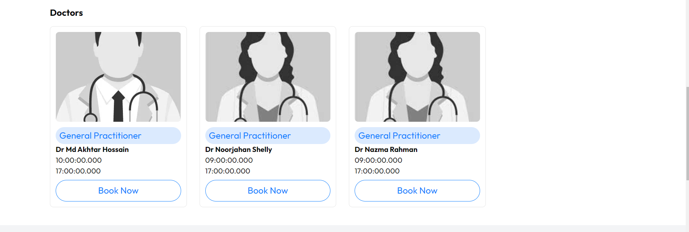
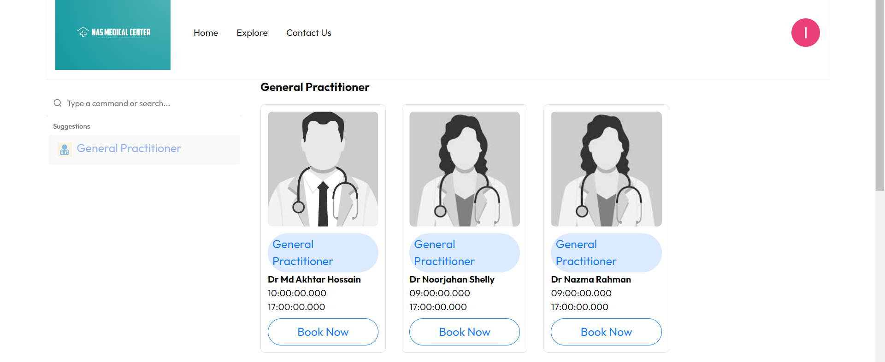
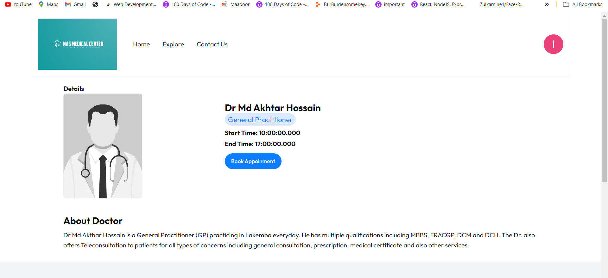
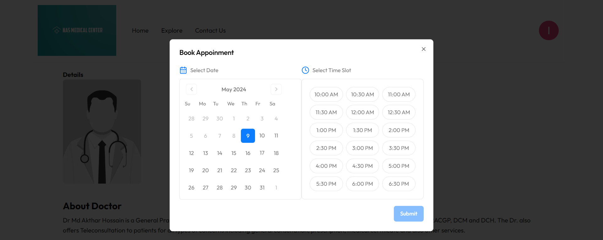

# Medical Web App Appointment Booking System

## Introduction

Welcome to the documentation for the Medical Web App Appointment Booking System! This document provides instructions on how to set up and run the project locally.

## Prerequisites

Before you begin, ensure you have the following installed on your local machine:

- Node.js
- npm or yarn
- MySQL database server
- Strapi backend server
- Git

## Installation

1. Clone the GitHub repository:
   ```bash
   git clone https://github.com/your-username/medical-appointment-system.git
   ```

Navigate to the project directory:
cd medical-appointment-system

Install dependencies:

npm install

Sure! Here's the content formatted as a README.md file:

markdown

# Medical Web App Appointment Booking System

## Introduction

Welcome to the documentation for the Medical Web App Appointment Booking System! This document provides instructions on how to set up and run the project locally.

## Prerequisites

Before you begin, ensure you have the following installed on your local machine:

- Node.js
- npm or yarn
- MySQL database server
- Strapi backend server
- Git

## Installation

1. Clone the GitHub repository:
   ```bash
   git clone https://github.com/your-username/medical-appointment-system.git
   Navigate to the project directory:
   bash
   ```

cd medical-appointment-system
Install dependencies:
bash

npm install
Configuration
Database Setup:
Create a MySQL database for the project.
Update the database configuration in the .env file with your database credentials.
Strapi Backend Setup:
Install Strapi globally:
bash

npm install -g strapi@latest
Start the Strapi server:
bash

cd backend
strapi develop
Frontend Setup:
Update the API endpoint in the .env.local file with your Strapi backend URL.
Running the Application
Start the Next.js frontend server:
bash

npm run dev
Access the application in your web browser at http://localhost:3000.
Additional Commands
Build the production-ready frontend:
bash

npm run build
Run tests:
bash

npm test
Contributing
If you'd like to contribute to this project, please fork the repository, make your changes, and submit a pull request.
